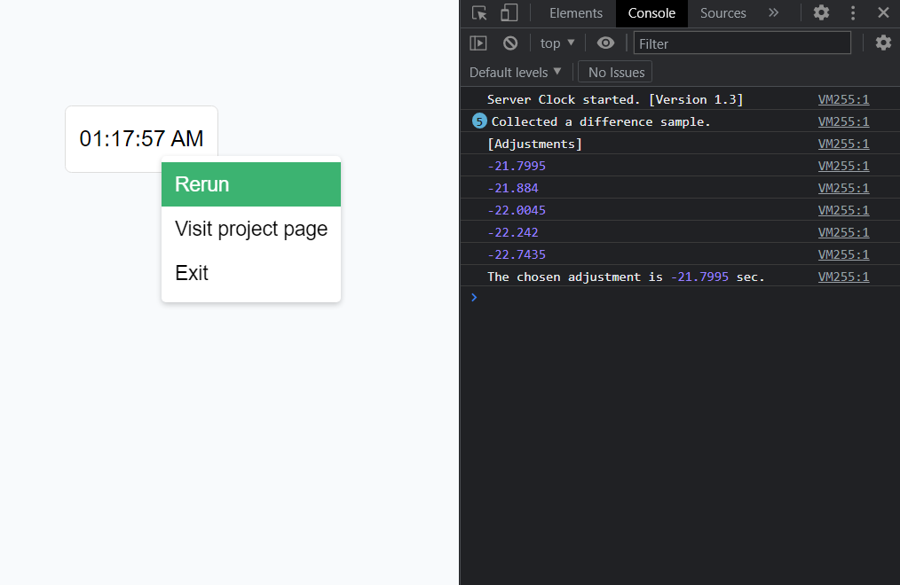

# Server Clock Bookmarklet

**Server Clock** is a JavaScript bookmarklet designed to display the system clock of the target web server.  
It is a reimplementation of [the previous project](https://github.com/r8btx/Server-Clock) with some improvements and additional features.

## Disclaimer

While **Server Clock** aims to be accurate, no warranty is given. Use at your own risk!  
**This repository is currently undergoing active maintenance. You may need to visit again for the latest updates. [[ChangeLog](./changelog.md)]**

## Quick Setup

- The most up-to-date bookmarklets are automatically generated on [Server Clock bookmarklet distribution page](https://r8btx.github.io/Server-Clock-Bookmarklet/page). For a quick setup, visit the page and follow the instructions.

If you wish to generate the bookmarklet manually from the source, you can do so using [this tool](https://chriszarate.github.io/bookmarkleter/).

## How to Use

1. Navigate to your target webpage. Example: [time.is](https://time.is)
2. Once the webpage is loaded, click `Server Clock` bookmarklet on your bookmark bar.
3. A small box will appear on your webpage. After the synchronization process, the web server's time will be displayed.

Tip 1: You can right-click on the box to use additional features.  
Tip 2: You can drag the box around for a better view.  
Tip 3: You can open the browser console (accessed via `F12` key) to see logs.  
Tip 4: The clock is most accurate when the page is freshly loaded.

## Screenshots



## How It Works (Overview)

1. Record the base time.
2. Send a HTTP GET request to the target web server using fetch().
3. The web server processes the request and sends back a HTTP response along with a generated `date` header.
4. Estimate the time difference between the base time and the time when the `date` header is generated. The estimation is based on [PerformanceObserver](https://developer.mozilla.org/en-US/docs/Web/API/PerformanceObserver).
5. The estimated server clock will be the result of the following calculation:
   ```txt
   Current Client Time + (HTTP `date` - (Base Time + Estimated Time-To-Respond))
   = Current Client Time + (HTTP `date` - Estimated Client Time when `date` is generated)
   = Current Client Time + Estimated Client/Server Time Difference
   = Estimated Current Server Time
   ```
6. Repeat the process and find the most accurate estimation.

## How It Works (Detail)

### Estimating the Time Difference


  
The `date` format appears as `Sat, 1 Jan 2000 12:00:00 GMT`, where time units below 1 second are omitted. Although it is not guaranteed, we assume that the omitted time units are truncated rather than rounded. For example, the trailing 0.999sec should be interpreted as 0sec instead of 1sec. Consequently, any accurate estimation of server time will always fall between the values of `date` and `date + 1sec` (represented by red bars).

During the synchronization process, **Server Clock** estimates `Base Time + Estimated Time-To-Respond`, as indicated by the second green bar in the image above. This estimation allows us to determine the `Client/Server Time Difference`.

The `date` value and its actual generation time can have a time difference ranging from 0 to 1 second due to truncation. This discrepancy leads to an inaccuracy (< 1sec) in the estimated `Client/Server Time Difference`. Therefore, it is necessary to implement a method for reducing the estimation inaccuracy.

### Estimation Pooling


One approach to mitigate the inaccuracy caused by truncation is through estimation pooling. Since server time estimations can be ordered from the most truncated to the least truncated, the rightmost estimation (shown as a red bar in the image above) is most likely to be the most accurate estimation.

To handle outliers, the estimation pooling process only considers estimations within a 1-second time frame that includes the most estimations.

### Others

**Server Clock** also attempts to:

1. Utilize a persistent connection to eliminate the overhead of establishing new connections for each request.
2. Prevent the serving of cached content to ensure up-to-date values for the date attribute.
3. Update the resulting clock at the start of each second to accurately synchronize the displayed clock to the estimated server time.
4. Determine if the collected sample size is sufficient to accurately estimate server time.
5. And others.

## Resources and References

- [Server Clock in PowerShell](https://github.com/r8btx/Server-Clock) - My previous project
- [Bookmarkleter](https://chriszarate.github.io/bookmarkleter/) - JavaScript to bookmarklet conversion
- [A Question of Timing](https://blog.cloudflare.com/a-question-of-timing/) - PerformanceObserver Timings Visual
- [Hypertext Transfer Protocol (HTTP/1.1): Semantics and Content](https://httpwg.org/specs/rfc7231.html#header.date) - `date` header in HTTP response
- [Time.is : exact time for any time zone](https://time.is/) - Tested against this web server
- [Time API: Time Zone API](https://www.timeapi.io/) - Tested against this web server. Use [test_accuracy.js](./js/test_accuracy.js) for future testings.
